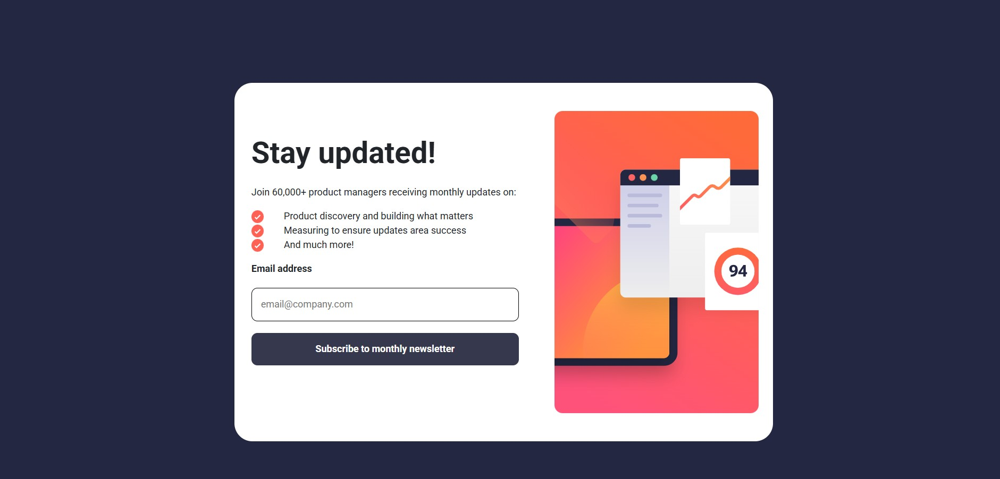
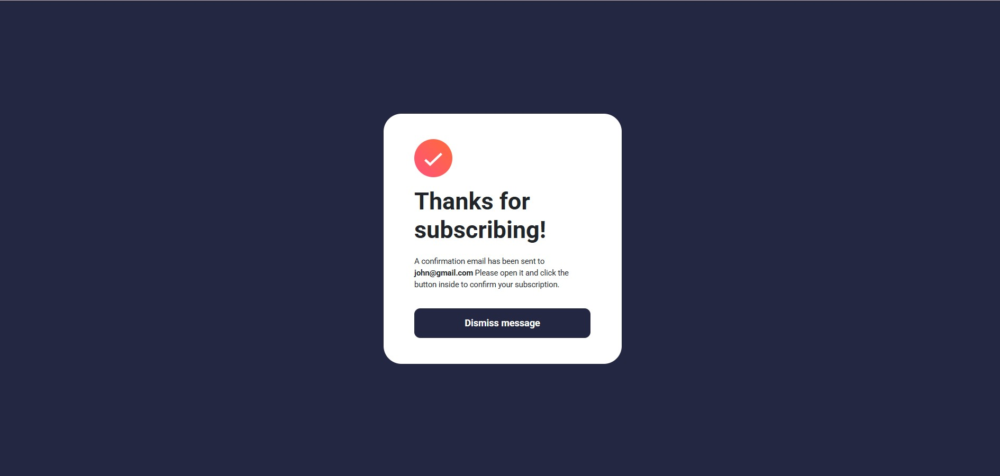

# Frontend Mentor - Newsletter sign-up form with success message solution

This is a solution to the [Newsletter sign-up form with success message challenge on Frontend Mentor](https://www.frontendmentor.io/challenges/newsletter-signup-form-with-success-message-3FC1AZbNrv). Frontend Mentor challenges help you improve your coding skills by building realistic projects.

## Table of contents

- [Overview](#overview)
  - [The challenge](#the-challenge)
  - [Screenshot](#screenshot)
  - [Links](#links)
- [My process](#my-process)
  - [Built with](#built-with)
  - [What I learned](#what-i-learned)
  - [Continued development](#continued-development)
  - [AI Collaboration](#ai-collaboration)
- [Author](#author)

## Overview

### The challenge

Users should be able to:

- Add their email and submit the form
- See a success message with their email after successfully submitting the form
- See form validation messages if:
  - The field is left empty
  - The email address is not formatted correctly
- View the optimal layout for the interface depending on their device's screen size
- See hover and focus states for all interactive elements on the page

### Screenshot




### Links

- Solution URL: (https://github.com/lillyleela/News-letter-component)
- Live Site URL: (https://lillyleela.github.io/News-letter-component/)

## My process

### Built with

- Semantic HTML5
- CSS3
- Bootstrap 5 (Grid & Utility Classes)
- Flexbox
- Media Queries
- JavaScript (DOM Manipulation & Event Handling)

### What I learned

While building this project, I learned how to:

- Validate email addresses using Regular Expressions (Regex).
- Manipulate the DOM with `getElementById()` and `querySelector()`.
- Handle events using `addEventListener()`.
- Toggle components using Bootstrap's `d-none` class.
- Reset form fields using the `reset()` method.
- Build responsive layouts for different screen sizes.
- Use the `<picture>` element to display different images for mobile and desktop devices.

Example of the email validation:

```javascript
const emailPattern = /^[^\s@]+@[^\s@]+\.[^\s@]+$/;

if (!emailPattern.test(email)) {
  error.textContent = "Valid email address required";
}
```

### Continued development

In future projects, I would like to focus on:

-Writing cleaner and more reusable JavaScript.
-Improving accessibility (ARIA labels, keyboard navigation, and screen reader support).
-Learning React.js for component-based UI development.
-Writing more maintainable and scalable CSS.

### AI Collaboration

-I used ChatGPT during this project to:

-Debug JavaScript errors.
-Improve form validation logic.
-Understand DOM manipulation techniques.
-Learn the correct way to reset forms.
-Implement responsive image handling using the <picture> element.
-Clarify Bootstrap utility classes and responsive layouts.

The AI helped me identify mistakes quickly and understand why they occurred, allowing me to build the project more efficiently while strengthening my JavaScript and frontend development skills.

## Author

- Leela
- Frontend Mentor - [@Leela](https://www.frontendmentor.io/profile/lillyleela)
